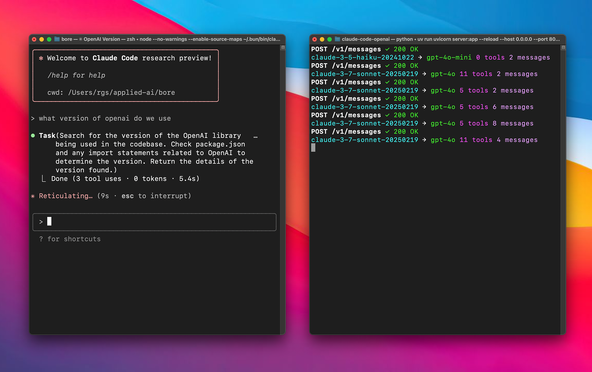

# Claude Code Proxy

Proxy server to use Anthropic clients (e.g., Claude Code) with OpenAI models by translating Anthropic Messages API requests to OpenAI Chat Completion API format.



## Features

- Receives Anthropic API requests and converts them to OpenAI Chat API format
- Supports both streaming and non-streaming responses
- Configurable mapping between Anthropic model names and OpenAI models
- Health check endpoint for monitoring
- Comprehensive OpenTelemetry instrumentation for distributed tracing
- Per-chunk event tracking for streaming responses

## Requirements

- Python 3.10 or higher
- OpenAI API key

## Installation

```bash
git clone https://github.com/1rgs/claude-code-openai.git
cd claude-code-openai
pip install .
```

## Configuration

Configuration is loaded from the XDG configuration directory by default:

- **Linux**: `~/.config/claude-code-proxy/config.toml`
- **macOS**: `~/Library/Application Support/claude-code-proxy/config.toml`
- **Windows**: `%APPDATA%\claude-code-proxy\config.toml`

If the configuration file is not present, you can use environment variables instead.

### Example `config.toml`

```toml
# OpenAI API key (required)
openai_api_key = "sk-...your-openai-key..."

#[anthropic_to_openai_model] # Mapping from Anthropic model names (glob patterns) to OpenAI model IDs
[anthropic_to_openai_model]
"claude-opus-4-*" = "gpt-4"
"claude-3-5-*"   = "gpt-3.5-turbo"

# Server settings (optional)
host = "0.0.0.0"
port = 8082
log_level = "INFO"         # one of: DEBUG, INFO, WARNING, ERROR

# Reasoning model parameters (optional)
# reasoning_effort = "medium"   # Options: low, medium, high
# reasoning_summary = "auto"    # Options: none, concise, detailed, auto
```

### Environment Variables

- `OPENAI_API_KEY` (required if not set in config)
- `PROXY_HOST`      (overrides `host`)
- `PROXY_PORT`      (overrides `port`)
- `LOG_LEVEL`       (overrides `log_level`)

### OpenTelemetry Configuration

- `OTEL_EXPORTER_OTLP_ENDPOINT` - OTLP collector endpoint (e.g., `http://localhost:4317`)
- `OTEL_EXPORTER_OTLP_INSECURE` - Use insecure connection (default: `true`)
- `DEPLOYMENT_ENV` - Environment name for traces (default: `development`)

## Claude Code setup

Drop this in `~/.claude/settings.json`:

```json
{
  "env": {
    "ANTHROPIC_BASE_URL": "http://localhost:8082",
    "ANTHROPIC_AUTH_TOKEN": "sk-claude-code-proxy-static-key"
  }
}
```

## Usage

Start the proxy using the console script (default localhost binding):

```bash
claude-code-proxy --host 127.0.0.1
```

You can override the host, port, or log level on the command line:

```bash
claude-code-proxy --host 127.0.0.1 --port 8082 --log-level debug
```

## Health Check

Verify that the proxy is running:

```bash
curl http://localhost:8082/health
```

## Integration with Claude Clients

Point your Anthropic client (e.g., Claude Code) to the proxy:

```bash
ANTHROPIC_BASE_URL=http://localhost:8082 claude
```

## Observability

### OpenTelemetry Tracing

The proxy includes comprehensive distributed tracing using OpenTelemetry. Each request creates a single parent span with events for all four stages:

1. **Anthropic Request** - Incoming request from Claude
2. **OpenAI Request** - Translated request to OpenAI
3. **OpenAI Response** - Response from OpenAI
4. **Anthropic Response** - Translated response to Claude

For streaming requests, each chunk is recorded as a separate event.

Example with Jaeger:
```bash
# Start Jaeger
docker run -d --name jaeger \
  -p 16686:16686 \
  -p 4317:4317 \
  jaegertracing/all-in-one:latest

# Configure proxy to send traces to Jaeger
export OTEL_EXPORTER_OTLP_ENDPOINT=http://localhost:4317
claude-code-proxy

# View traces at http://localhost:16686
```

### Legacy JSONL Logging

For backward compatibility, JSONL logs are still written to the application state directory:

- **Linux**: `~/.local/state/claude-code-proxy/logs/<timestamp>/` or `$XDG_STATE_HOME/claude-code-proxy/logs/<timestamp>/`
- **macOS**: `~/Library/Application Support/claude-code-proxy/logs/<timestamp>/`
- **Windows**: `%LOCALAPPDATA%\claude-code-proxy\logs\<timestamp>\`

You can override the base state directory on Linux by setting the `XDG_STATE_HOME` environment variable.

## Contributing

Contributions are welcome! Please open an issue or submit a pull request.

---

*This project is licensed under the MIT License.*
